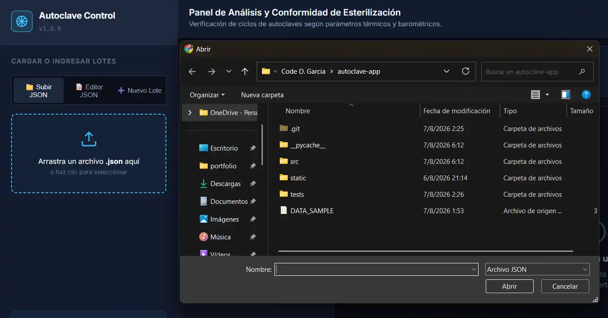
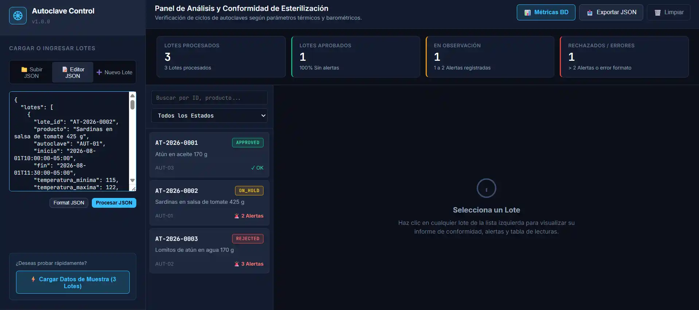

# 🧪 Sistema de Control y Procesamiento de Ciclos de Esterilización en Autoclaves

> **Caso de Estudio / Prueba Técnica de Desarrollo Software**  
> Solución integral para la orquestación, validación, procesamiento y supervisión en tiempo real de ciclos de esterilización en autoclaves industriales.

---

# RESPUESTAS A LAS PREGUNTAS SQL:
### 📝 [RESPUESTAS](RESPUESTAS_POSTGRESQL.md) <--
## 📌 Resumen del Proyecto

Este proyecto resuelve la necesidad de validar y analizar automáticamente la telemetría (temperatura y presión) de lotes de esterilización en autoclaves. El sistema evalúa cada lectura registrada frente a los límites técnicos configurados.

## 🚀 Requisitos e Instalación

### Requisitos Previos
- **Python**: Versión 3.9 o superior.
- **pip**: Gestor de paquetes de Python.
- **postgresql**: Version 16 o superior [Revisar script para conocer mas sobre la BD](script_prueba_postgresql.sql) 

### Pasos de Instalación

1. **Clonar o descargar el repositorio**:
   ```bash
   git clone https://github.com/Code-D-Garcia/autoclave-app.git
   cd autoclave-app
   ```

2. **Crear y activar un entorno virtual (Recomendado)**:
   - En Windows (PowerShell):
     ```powershell
     python -m venv venv
     .\venv\Scripts\Activate.ps1
     ```
   - En Linux/macOS:
     ```bash
     python3 -m venv venv
     source venv/bin/activate
     ```

3. **Instalar las dependencias**:
   ```bash
   pip install -r requirements.txt
   ```

4. **Configurar las variables de entorno para la Base de Datos (Opcional)**:
   El repositorio incluye el archivo `.env.example` como plantilla para la conexión a PostgreSQL:
   ```bash
   cp .env.example .env
   ```
   Edita las variables en `.env` según la configuración de tu instancia de PostgreSQL:
   - `DB_HOST`: Host o IP del servidor PostgreSQL (ej. `localhost`).
   - `DB_PORT`: Puerto del servicio de PostgreSQL (por defecto `5432`).
   - `DB_NAME`: Nombre de la base de datos (ej. `db_autoclave_esterilizacion`).
   - `DB_USER`: Usuario administrador / rol con permisos de lectura y escritura.
   - `DB_PASSWORD`: Contraseña correspondiente.

   *(Nota: Si no se define el archivo `.env` o la BD no se encuentra accesible, la API funcionará en modo fallback procesando los datos en memoria).*

---

## 💻 Ejecución de la Aplicación

Para iniciar el servidor web y la API REST en modo de desarrollo local:

```bash
py -m uvicorn api:app --reload
```
*(o usa `python -m uvicorn api:app --reload`)*

Una vez iniciado el servidor, accede a través de tu navegador:

- **🖥️ Tablero de Control Web**: [http://127.0.0.1:8000](http://127.0.0.1:8000)
- **📚 Documentación Swagger UI (OpenAPI)**: [http://127.0.0.1:8000/docs](http://127.0.0.1:8000/docs)
- **❤️ Chequeo de Salud de la API**: [http://127.0.0.1:8000/api/health](http://127.0.0.1:8000/api/health)

---

### 📸 Carga de Datos en la Interfaz Web

La aplicación web ofrece diferentes alternativas para ingresar y evaluar los lotes de esterilización:

1. **Cargar archivo `.json`**: La interfaz incluye un botón para cargar un archivo `.json` desde el equipo. Se incluye en la raíz del proyecto el archivo de ejemplo `DATA_SAMPLE.json` para facilitar las pruebas.



2. **Pegar JSON manualmente**: Alternativamente, se puede pegar el contenido JSON directamente en el editor de código integrado en la pantalla.



> [!NOTE]
> **Nota Técnica:** En caso de experimentar latencia en la renderización asíncrona de los componentes o retrasos en la actualización del DOM tras procesar el *payload*, se recomienda recargar la página (`F5` / `Ctrl + R`) para re-inicializar el estado del cliente y forzar la re-sincronización con la API REST.

---

### 🌟 Puntos Destacados de la Solución
- **Arquitectura Limpia**: Separación estricta entre modelos de dominio, validadores, procesadores de regla de negocio, servicio de orquestación y capa de API REST.
- **API REST con FastAPI**: Endpoints asíncronos con documentación OpenAPI (Swagger) interactiva generada automáticamente.
- **Interfaz de Usuario Operativa (Web UI)**: Interfaz creada con ayuda de la IA para facilitar la presentación de la solución. Permite subir un `.json`, pegar uno en el editor de código y agregar lotes de forma manual.
- **Pruebas Automatizadas**: Cobertura en los 6 escenarios críticos de dominio usando `pytest`.

---

## 🛠️ Arquitectura y Estructura del Proyecto

```text
autoclave-app/
├── api.py                      # Servidor API REST con FastAPI (Endpoints, ruteo estático y analítica)
├── requirements.txt            # Dependencias del proyecto (FastAPI, Pytest, Psycopg2, etc.)
├── .env.example                # Plantilla de variables de entorno para la BD PostgreSQL
├── README.md                   # Documentación principal del proyecto
├── DATA_SAMPLE.json            # Archivo de datos JSON de muestra para pruebas
├── RESPUESTAS_POSTGRESQL.md    # Respuestas teóricas y técnicas a las 5 preguntas de PostgreSQL
├── script_prueba_postgresql.sql# Script SQL ejecutable en pgAdmin / psql para probar la BD
├── .gitignore                  # Exclusión de archivos temporales
├── public/                     # Recursos gráficos para documentación
│   ├── cargar_sample.webp      # Captura del botón para cargar archivo JSON de muestra
│   └── pegar_sample.webp       # Captura de la opción para pegar JSON manualmente
├── src/                        # Núcleo de lógica de negocio (Domain-Driven Design)
│   ├── __init__.py
│   ├── models.py               # Dataclasses y Enums (Lot, Reading, LotReport, Status)
│   ├── exceptions.py           # Jerarquía de excepciones personalizadas de dominio
│   ├── validators.py           # Parser flexible y reglas de validación de datos/fechas
│   ├── processors.py           # Clasificación de lecturas y cálculo del estado del lote
│   ├── service.py              # Servicio orquestador principal de lotes y archivos
│   └── database.py             # Módulo de persistencia PostgreSQL (Persistencia y consulta analítica)
├── static/                     # Interfaz de usuario (Frontend web)
│   ├── index.html              # Estructura semántica HTML5
│   ├── styles.css              # Estilos CSS3 (Tema profesional laboratorio/industrial)
│   └── app.js                  # Lógica interactiva del cliente (AJAX, Filtros, Formulario)
└── tests/                      # Pruebas automatizadas
    ├── __init__.py
    └── test_sterilization.py   # 6 Casos de prueba automatizados con pytest
```

---

## ⚙️ Reglas de Negocio Implementadas

### 1. Clasificación de Lecturas por Registro
- **`NORMAL`**: Temperatura y presión se mantienen dentro de los rangos especificados.
- **`TEMP_ALERT`**: Temperatura fuera de los límites mínimo/máximo configurados.
- **`PRESSURE_ALERT`**: Presión fuera de los límites mínimo/máximo configurados.
- **`MULTI_ALERT`**: Tanto la temperatura como la presión están fuera de rango simultáneamente.

### 2. Dictamen Final del Lote (`LotStatus`)
- **`APPROVED` (Aprobado)**: `0` alertas registradas.
- **`ON_HOLD` (En Observación)**: De `1` a `2` alertas registradas.
- **`REJECTED` (Rechazado)**: Más de `2` alertas registradas o fallos de validación de estructura.

---

## 🧪 Pruebas Automatizadas

La suite de pruebas cubre los **6 escenarios esenciales** requeridos por la prueba técnica.

### Ejecutar las Pruebas
Ejecuta el siguiente comando en la raíz del proyecto:

```bash
py -m pytest -v
```

### Detalle de los 6 Casos de Prueba (`tests/test_sterilization.py`)

| # | Caso de Prueba | Función de Test | Descripción |
| :---: | :--- | :--- | :--- |
| **1** | **Caso correcto** | `test_caso_correcto` | Procesa un lote 100% válido y comprueba el dictamen `APPROVED`. |
| **2** | **Fecha inválida** | `test_fecha_invalida` | Valida que una fecha mal formada lance `LoteValidationError`. |
| **3** | **Rango inválido** | `test_rango_invalido` | Detecta límites térmicos o barométricos invertidos (`min > max`). |
| **4** | **Lectura fuera del ciclo** | `test_lectura_fuera_del_ciclo` | Detecta lecturas fuera del horario `start_time` - `end_time`. |
| **5** | **Alerta múltiple** | `test_alerta_multiple` | Verifica la clasificación `MULTI_ALERT` ante desviación doble. |
| **6** | **Cálculo de estado** | `test_calculo_de_estado` | Evalúa las transiciones a `APPROVED`, `ON_HOLD` y `REJECTED`. |

---

## 📡 Endpoints Principales de la API

| Método | Ruta | Descripción |
| :--- | :--- | :--- |
| `GET` | `/` | Sirve la interfaz web interactiva. |
| `GET` | `/api/health` | Retorna el estado de salud y versión del servicio. |
| `GET` | `/api/sample-data` | Entrega un dataset de muestra representativo (3 lotes). |
| `POST` | `/api/process-data` | Recibe datos JSON en el cuerpo HTTP y retorna el informe. |
| `POST` | `/api/process-file` | Permite la subida multipart de archivos `.json`. |
| `POST` | `/api/process-lot` | Procesa un lote individual directo en formato JSON. |

### Ejemplo de Carga JSON de Entrada (`POST /api/process-data`)

```json
{
  "lotes": [
    {
      "lote_id": "AT-2026-0001",
      "producto": "Atún en aceite 170 g",
      "autoclave": "AUT-03",
      "inicio": "2026-08-01T08:00:00-05:00",
      "fin": "2026-08-01T09:15:00-05:00",
      "temperatura_minima": 116.0,
      "temperatura_maxima": 123.0,
      "presion_minima": 1.20,
      "presion_maxima": 1.80,
      "lecturas": [
        {"fecha_hora": "2026-08-01T08:10:00-05:00", "temperatura": 117.2, "presion": 1.35},
        {"fecha_hora": "2026-08-01T08:20:00-05:00", "temperatura": 121.0, "presion": 1.62},
        {"fecha_hora": "2026-08-01T08:30:00-05:00", "temperatura": 119.5, "presion": 1.50}
      ]
    }
  ]
}
```

---

## 👨‍💻 Autor y Licencia

Desarrollado como solución a prueba técnica para evaluación de competencias en desarroll de software con Python. Apoyandome en la IA para la interfaz y validaciones de datos. Asi como en la organización de esta documentación para transmitir de mejor manera mis ideas.
